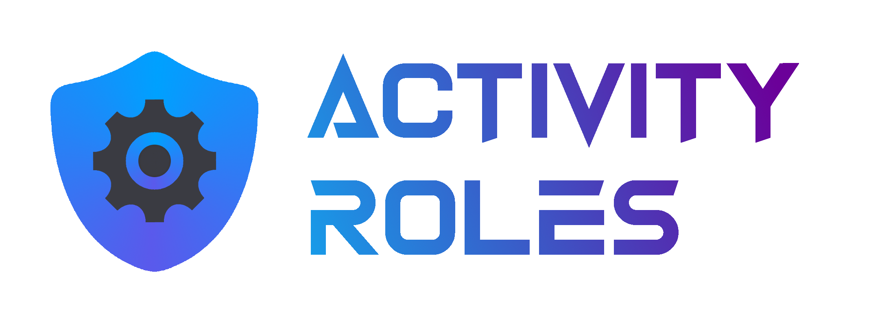

---

A Discord bot for automatic role assignment based on activities. \
Please join the [support guild](https://discord.gg/3K9Yx4ufN7) for the latest updates and infos. \
Initially inspired by [Game Roles](https://top.gg/bot/511010215290863636).

---

I don’t use the bot myself. If you want to speed up development or help
me pay for the server, please consider supporting me ([GitHub Sponsors](https://github.com/sponsors/tippfehlr) or [Ko-fi](https://ko-fi.com/Z8Z7SYDDJ)).

---

**Now with `/statusrole`!** \
Assign roles based only on the status.
Every person playing could have the role `@playing`, for example.

---

## Configuration

**The bot will not remove any roles that were added manually.**

To list all roles, use `/listroles`.

### Activity Roles

Add an activity role with `/addactivityrole`.
By default, the bot will remove the role again when the activity ends. \
If you set `permanent` to true, the bot will not remove the role.

`exact_activity_name` can be set to true if you get false-positives.

### Status Roles

Set a status role with `/setstatusrole`.

## Contribution

Contribution is highly appreciated. Feel free to join the support
guild or open an issue or pull request.

### Translation

The default language of the bot is English. \
Available translations:

[].data.translationProgress&url=https%3A%2F%2Fbadges.awesome-crowdin.com%2Fstats-15099081-554085.json>)](https://crowdin.com/project/activity-roles/fr) \
Help translate the bot on [Crowdin](https://crowdin.com/project/activity-roles).

#### Thanks:

- @eianlee
- @umkrampus **[Brazilian Portuguese]**
- @RstY_CZ#2033 **[Czech]**
- @dangerbeclose **[Dutch]**
- @skyykc#0218
- @money143
- @Hugo Moreira#4306
- Tillmann Taute **[German]**
- ZamestoTV **[Russian]**
- @.onepunch. **[Ukrainian]**
- @deflanko
- @itshendrik **[Estonian]**
- arceus (@blurwind) **[French]**

If I forgot you, please let me know!

Made with ❤️ by tippfehlr.
